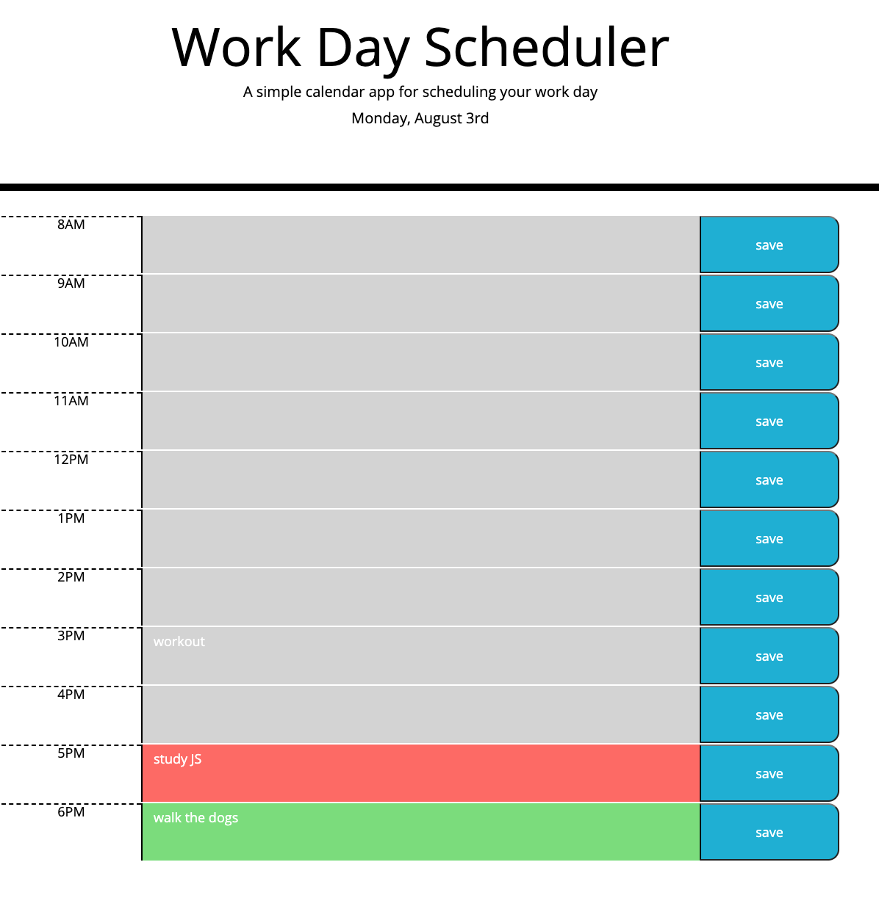

# WorkDayScheduler

## Summary

This JavaScript tool allows you to generate random passwords based on user-selected criteria. 

## Detail:
- length : can choose a length of at least 8 characters and no more than 128 characters. If user selection is invalid, default length of 8 characters is used.
- character type: can choose lowercase, uppercase, numeric, and/or special characters
-  input are validated: at least one character type should be selected, otherwise default character set is used.
- randomly generate a password 
- the password is either displayed in an alert or written to the page

The following image demonstrates the application functionality:

